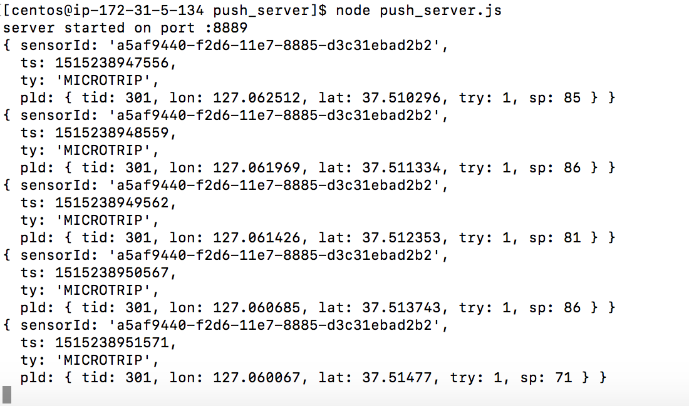
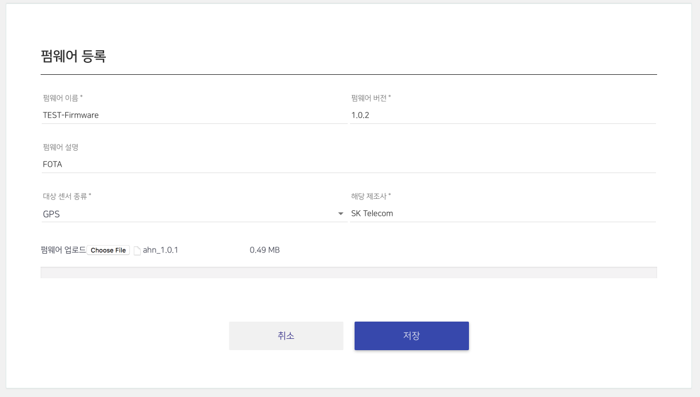

.. |br| raw:: html

Best Practices
=======================================

Smart[Fleet] 플랫폼을 기반으로 Connected Car 솔루션 개발 시 필요한 주요한 Tip을 제공합니다.

Web Push
-----------------------

Smart[Fleet] 플랫폼은 차량 디바이스로 부터 전달 받은 데이터 및 제어 정보를 실시간으로 Push 받을 수 있습니다.
Push 메시지를 수신하기 위해서는 아래 2가지 준비가 필요합니다.

1. Push 메시지를 수신하기 위한 서버 정보 멏 수신하고자 하는 메시지 타입 정의
2. Push 메시지 수신을 위한 서버 기동

Push 메시지 타입 및 수신 서버 주소 정의
~~~~~~~~~~~~~~~~~~~~~~~~~~~~~~~~~~~~~~~

수신받고자 하는 Push 메시지 타입이나 수신 서버는 Smart[Fleet] 내 서비스 정보를 
저장하는 ``Company`` 엔티티에 명시합니다. 
`Company Entity <http://smart-fleet-docs.readthedocs.io/ko/latest/entity/#company-registration-api>`__ 
API를 통해 아래 2가지 Key 정보를 상황에 맞추어 수정하면 됩니다.

===============  ========================================================
Key              Description
===============  ========================================================
notifyHost       Push 메시지 수신 서버 경로 정보
notifyMsgType    수신하고자 하는 Push 메시지 타입 정보

                 * ty 번호를 Comma로 구분하여 명세
                 * 300 : All RPC Messages
                 * 400 : All Rule Alarm Messages
===============  ========================================================

예를 들어, HTTP 서버 주소가 http://192.168.0.100:9090/noti 이고 
수신하고자 하는 메시지의 ty 값이 7, 8, 101, 102 이고, 
추가로 RPC 제어 결과를 Push 받고자 하면 PUT Method를 통해 기존에 저장된 Company Entity를 수정한다.

.. code-block:: json

    {
        "notifyHost":"http://192.168.0.100:9090/noti",
        "notifyMsgType": "7, 8, 101, 102, 300"
    }
 
상기 과정을 정상적으로 수행하면 Smart[Fleet] 플랫폼의 선택된 메시지들을 정의된 HTTP 서버에 전송합니다.

Push 메시지 수신을 위한 서버 기동
~~~~~~~~~~~~~~~~~~~~~~~~~~~~~~~~~~~~~~~

Smart[Fleet]에서 제공하는 Push 메시지는 HTTP 프로토콜을 준수하며, 
메시지를 수신하기 위해서는 HTTP 서버 운용하여야 합니다.

간단한 테스트를 위해 node.js 기반의 HTTP 서버를 AWS 인스턴스에 기동하여 정상적으로 메시지를 수신하는 테스트를 진행합니다.

아래는 node.js의 express 모듈을 통해 구현된 HTTP POST 요청을 수신하고 응답하는 코드입니다. node.js 및 express 모듈에 대한 설명은 생략 합니다.

.. code-block:: javascript
    
    var http = require('http');ㄱ

    http.createServer(function (req, res) {
    var jsonData = "";
    req.on('data', function (chunk) {
        jsonData += chunk;
    });
    req.on('end', function () {
        console.log(jsonData);
        res.writeHead(200);
    });
    }).listen(8888);

상기 코드를 AWS 인스턴스에 구동시키고 Smart[Fleet] 프로토콜을 준수하는 단말이 메시지를 플랫폼에 전달하면, 다음과 같이 Push 메시지가 전달 되는 것을 볼 수 있습니다.

|br|

FOTA
----

General Information
~~~~~~~~~~~~~~~~~~~~~

본 장에서는 Smart[Fleet]을 통해서 FOTA ``Firmware Over The Air`` 를 수행하는 방법에 대해서 기술합니다.

Smart[Fleet] 플랫폼에 정상적으로 등록한 단말은 다음과 같이 2가지 방법을 통해서 FOTA를 수행합니다.

1. By Portal - Smart[Fleet] 홈페이지를 통해서 FOTA를 요청하는 방법
2. By RPC - Smart[Fleet]의 RPC를 통해서 FOTA를 요청하는 방법

Architecture
~~~~~~~~~~~~~

상기 언급된 2가지 FOTA 방식에 대한 Smart[Fleet]의 구조는 아래와 같습니다. 
FOTA는 실제적으로는 Smart[Fleet]에 있는 RPC에 `Firmware Update RPC 
<http://smart-fleet-docs.readthedocs.io/ko/latest/message/#firmware-update>`__ 방식을 따릅니다.

.. image:: ../images/fota/FOTA_arc.png

FOTA by Portal
^^^^^^^^^^^^^^

본 방법은 FOTA를 Smart[Fleet]의 홈페이지를 이용하여 진행하는 방법을 기술합니다.

.. rst-class:: text-align-justify

1. 홈페이지에 Firmware를 저장합니다. Firmware를 저장할 때는 아래의 
홈페이지에 FOTA 메뉴 하단에 ``펌웨어`` 를 클릭합니다.

.. image:: ../images/fota/FOTA_menu.png

.. rst-class:: text-align-justify

2. 아래와 같이 펌웨어에 대한 기본 정보와 펌웨어 파일을 올립니다. 
Smart[Fleet]에서는 같은 서비스 내 등록된 단말 타입과 제조사명을 기반으로 Firmware를 구분합니다.

예를 들면, 아래 그림과 같이 ``SK Telecom`` 이 제조한 ``GPS`` 단말이 해당 서비스에 1,000대가 있다고 가정하면, 
지금 등록하는 Firmware는 해당 1,000대 적용되는 Firmware라고 보시면 됩니다.

3. 진행하고자 하는 FOTA를 설정합니다. 아래 그림과 같이 진행하고자 하는 센서 타입을 설정하고, 업데이트 할 펌웨어 버전을 선택하고,
마지막으로 FOTA를 수행할 시간을 설정합니다. 설정한 시간에 맞추어 Smart[Fleet] 포털에서 상기 신청한 센서 타입의 센서에
일괄 FOTA를 위한 RPC를 전달합니다. 

.. image:: ../images/fota/FOTA_Registration.png

4. 3번 과정을 정상적으로 진행하면, 
아래와 같은 FOTA 진행 현황을 보실 수 있습니다. FOTA 상태 항목에는 ``처리중`` 이라는 상태를 파악하실 수 있습니다.

.. rst-class:: text-align-justify

.. image:: ../images/fota/FOTA_In_Progress.png

5. Smart[Fleet] 시스템은 고객께서 3번 과정에 신청한 시간에 맞추어 단말에 RPC 요청을 전달합니다. 
해당 RPC에 대한 Protocol은 `Firmware Update RPC 
<http://smart-fleet-docs.readthedocs.io/ko/latest/message/#firmware-update>`__ 방식을 따르며,
Smart[Fleet] 단말 시뮬레이터를 기반으로 동작하면, 다음과 같이 RPC 메시지를 단말이 수신하는 것을 볼 수 있습니다.

좀더 상세하게는 Firmware가 저장된 위치를 제공하므로써 단말이 해당 경로를 통해서 Firmware를 수신할 수 있도록 가이드 합니다. 
해당 위치는 상기 3번 과정에 명시된 Firmware 경로 정보와 동일합니다. 

.. image:: ../images/fota/FOTA-Device.png

6. FOTA RPC를 전송한 후에 결과를 모두 수신한 
Smart[Fleet]은 다음과 같이 FOTA 상태를 ``완료`` 로 명시합니다. 

.. image:: ../images/fota/FOTA_done.png

7. 상세한 FOTA 정보는 6번 화면의 FOTA 상태를 클릭하면 아래와 같이 화면이 나오고, 아래 예제와 같이 FOTA가 실패한 경우에는 
FOTA 재신청을 요청할 수 있습니다. 해당 재시도는 실패한 단말에 대해서 진행합니다.

.. image:: ../images/fota/FOTA_done_detail.png