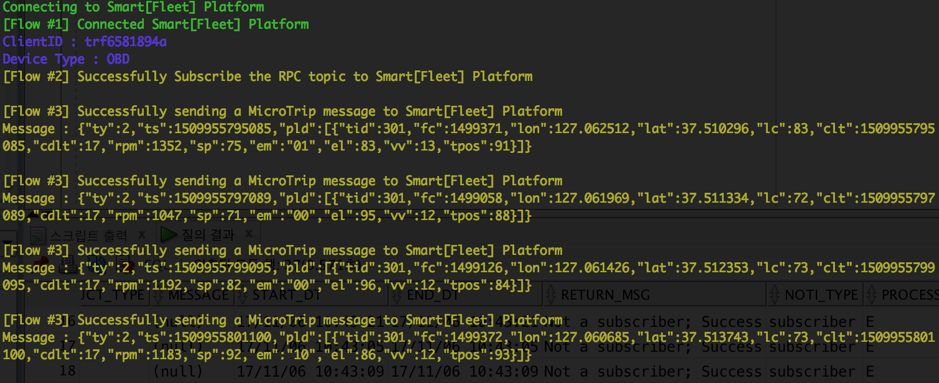
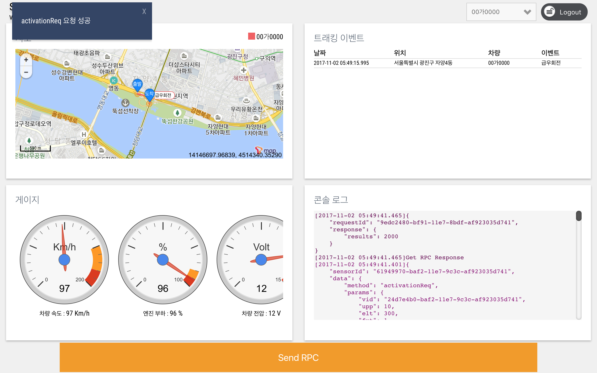

.. |br| raw:: html

    

테스트용 시뮬레이터
========================

.. rst-class:: text-align-justify

본 가이드 문서 중 3.4. Device 연동 절차/*링크*/ 또는 아래 그림의 서비스 연동 기본 절차에서 볼 수 있듯이 서비스를 이용하려면 어플리케이션과 디바이스(센서) 둘다 필요합니다.

|br|

.. image:: ../images/simulator/7.png

|br|

SKT에서는 개발 파트너분들 중 센서/디바이스 혹은 어플리케이션 하나만 테스트를 원할 경우를 대비하여 디바이스/센서 및 애플리케이션 대행 역할을 담당하는 테스트용 시뮬레이터를 제공합니다.

|br|
|br|

Smart[Fleet] Device Simulator
-------------------------------

.. rst-class:: text-align-justify

Smart[Fleet] Device Simulator는 디바이스/센서 역할을 대행해주는 OBD 운행 데이터 및 RPC 송수신 시뮬레이터 입니다.  해당 시뮬레이터에 대한 추가 사용 설명과 프로그램 다운로드는 아래 사이트를 방문하시기 바랍니다.

.. rst-class:: text-align-justify

- Smart[Fleet] Device Simulator : https://github.com/skt-smartfleet/device-simulator

|br|

|br|

.. rst-class:: text-align-justify

해당 시뮬레이터는 node.js 기반으로 구현되어 있습니다.  본 시뮬레이터가 정상적으로 동작하기 위해서는 node.js가 설치되어 있어야 합니다.
|br|
동작을 위한 설정은 본 Repository의 config.js 파일에 기술되어 있습니다. 해당 설정을 수정하여 각자에 상황에 맞추어 시뮬레이션을 수행할 수 있습니다.
|br|
수정이 필요한 사항은 다음과 같습니다.

.. rst-class:: table-width-fix
.. rst-class:: text-align-justify

+-----------------------+---------------------------------------------------------------------------+
| Key                   | Description                                                               |
+=======================+===========================================================================+
| userName              | Accesstoke 값을 기입해야 합니다. 시뮬레이션을 위한 20자리의 Token 값을    |
|                       | 발급받기 위해서는 `Repository Issue`_ 에 이슈 등록 부탁드립니다.          |
+-----------------------+---------------------------------------------------------------------------+
| updateInterval        | 단말이 메시지를 업로드 하는 주기를 명시합니다. (msec)                     |
+-----------------------+---------------------------------------------------------------------------+
| microtripcnt          | 단말이 주기 정보를 보내는 총 개수를 명시합니다.                           |
+-----------------------+---------------------------------------------------------------------------+
| deviceType            | 시뮬레이션을 돌리고자 하는 디바이스 타입을 명시합니다. (GPS / OBD)        |
+-----------------------+---------------------------------------------------------------------------+

.. _Repository Issue: https://github.com/skt-smartfleet/device-simulator/issues

|br|
|br|

.. _web-application-simulator:

Smart[Fleet] Web Application Simulator
---------------------------------------

.. rst-class:: text-align-justify

Smart[Fleet] Web Application Simulator는 OBD 운행 데이터 확인 및 RPC 요청 기능을 구현한 웹 애플리케이션 시뮬레이터입니다.  해당 시뮬레이터에 대한 추가 사용 설명과 프로그램 다운로드는 아래 사이트를 방문하시기 바랍니다.

.. rst-class:: text-align-justify

- Smart[Fleet] Web Application Simulator : https://github.com/skt-smartfleet/simpleweb

|br|

|br|

.. rst-class:: text-align-justify

해당 애플리케이션은 node.js 기반으로 구현되어 있습니다. 본 시뮬레이터가 정상적으로 동작하기 위해서는 node.js가 설치되어 있어야 합니다. 애플리케이션을 이용하기 위해 차량, 센서 정보가 있는 Smart [Fleet] 계정이 필요합니다. 계정이 없을 경우 본 가이드 문서 :ref:`3.2. 구성요소 등록 절차 <entity-procedure>` 를 참조하여 계정을 생성하시기 바랍니다.
|br|
Smart[Fleet] Web Application 페이지는 4개의 View로 구성되며 10초마다 최신 Microtrip 운행 정보를 가져옵니다.

.. rst-class:: text-align-justify

* 지도 : microtrip 운행 정보를 지도에 표시합니다.
* 트래킹 이벤트 : 운행 정보의 트래킹 이벤트를 표로 나열합니다.
* 게이지 : 선택된 차량의 운행 정보를 각 게이지 차트로 나타냅니다.
* 콘솔 로그 : RPC 및 운행 정보를 JSON 형태로 확인할 수 있습니다. 로그는 시간 역순으로 나열됩니다.

.. rst-class:: text-align-justify

하단에는 RPC 버튼이 있어서, 해당 버튼을 클릭하면 RPC 요청을 전송합니다. 해당 요청에 대한 결과는 페이지 상단에 토스트 메세지로 올라옵니다.

|br|
|br|
